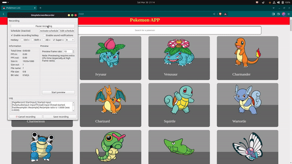

# Welcome to the best Pokemon-App

This Pokemon application is created using 

- Node JS
- EJS
- Bootstrap
- Animate on Scroll

## How to run the application

Clone the  repository using 
``` 
https://github.com/aswinuci/Pokemon-App.git
```

Install the dependencies using 

```
npm install
```
Run the application using 
```
npm run dev ( for development ) / npm start
```

You will be able to see the application run on 
``` 
PORT = 5000
```

## Below is a sample of how the application main page looks like 


## I have addedAnimate On Scroll Features as shown below 


## We can search for a Pokemon on the search app, we'll receive sugegstions



## Below is the pokemon-detail page 


## The Application is completely responsive


&copy; Aswin Sampath

Made with 💛

